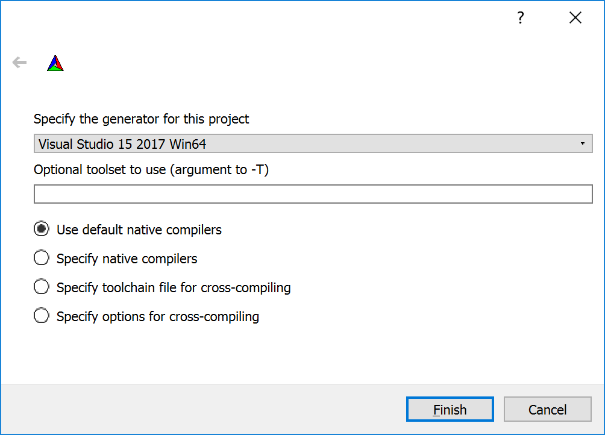

# Create a Visual Studio Solution

We want to create a Visual Studio Solution from a checkout repository.

1. Start CMake
1. Where is the source code, e.g., `D:/code/ComputerGraphics`
1. Where to build the binaries, e.g., `D:/code/ComputerGraphicsBuild`
         
1. Click Configure. This should check if your system has everything that is required to create the project.
    - In case the build directory does not exist, CMake asks you whether to  create it or not.
        - Select Yes and have CMake create the build directory.
    - Select "Visual Studio 15 2017 Win64" as generator to create a 64-Bit Visual Studio 2017 solution:
         
    - Use the default native compilers.
    - In case you want to use Intel Compilers, add the proper Intel Compiler name (e.g., "Intel C++ Compiler 19.0") to the "Optional toolset to use (argument to -T)" field:
         
    - Click Finish
1. There should not be any errors.
1. Click Generate. This should create the Visual Studio Solution in `D:/code/ComputerGraphicsBuild`.
1. Click Open Project. This will open the solution.
1. Build the project in Visual Studio. The first build should take a while.

