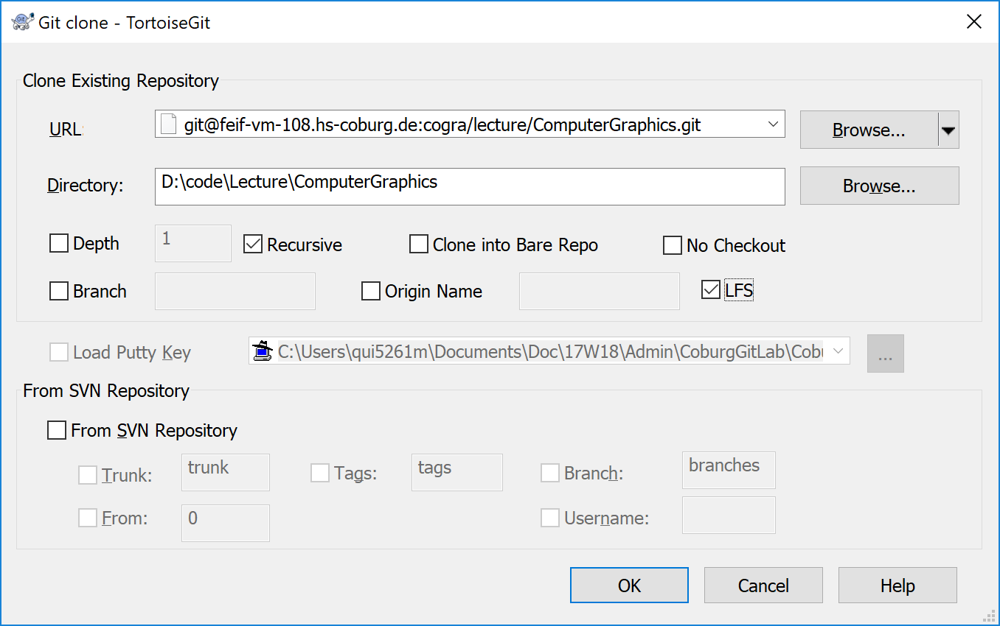

# Create a Repository that Submodules Libcogra
This document describes, how a new repository is added that uses libcogra.

This is useful for
- students that want to start a thesis and use the convenience of libcogra,
- instructors that want to create assignments and labs based on libcogra, and
- researcher that want to use libcogra for their research projects.

## Required Software
1. git-bash
1. Tortoise Git (optional)
1. CMake

## Get Your own Repository.

1. Make sure you are in the Campus Network or using VPN.

1. Use your university LDAP credentials to login to http://feif-vm-108.hs-coburg.de/

1. Tell your instructor that you have logged in to http://feif-vm-108.hs-coburg.de/. 

1. Instructor creates new git repository (e.g., `git@feif-vm-108.hs-coburg.de:cogra/lecture/ComputerGraphics.git`) and will send you the path.

1. Clone repository to your local disk.
    - git-bash        
        - `git clone --recursive git@feif-vm-108.hs-coburg.de:cogra/lecture/AdvancedComputerGraphics.git`
    - Tortoise Git
    -   Open Windows Explorer
    -   Navigate to the folder where you want to clone the repository into, e.g., `D:/code`
    -   Right click to open the context menu
    -   Select "Git Clone". The follwing dialog should appear:    
        
        - Select URL: `git@feif-vm-108.hs-coburg.de:cogra/lecture/ComputerGraphics.git.`
        - Directory: `D:/code/ComputerGraphics`
        - Select Recursive
        - Select LFS
        - Click OK

    - You should have a clonsed repository in  `D:/code/ComputerGraphics` folder.

## Add libcogra as Submodule

1. Add libcogra as submodule 
    - git-bash:
        - `cd ComputerGraphics`
        - `git lfs install --skip-smudge # this is due to a bug in lfs see https://github.com/git-lfs/git-lfs/issues/911`
        - `git submodule add git@feif-vm-108.hs-coburg.de:cogra/libcogra.git libcogra`
        - `git lfs install --force # this is due to a bug in lfs`
        - `cd libcogra/data`
        - `git lfs fetch # get all the files`
        - `git lfs pull`      

    - If you intend to modify libcogra, you should get a branch of the libcogra repository. 
        - `git checkout <yourbranch>`

1. Update the submodule.
    - **What**: Gets the latests sources from the submodules 
    - git-bash
        - `git submodule update --init --recursive`
    - Tortoise Git
        - In Windows Explorer, navigate *into* the directory of the cloned repository, e.g., `D:/code/ComputerGraphics`
        - From the folder's context menu, select `TortoiseGit | Submodule Update`
        - The following dialog should appear

               
            
        - Make sure to have the recursive option on so that not only libcogra is fetched, but libcogra's submodules (assimp, glfw, etc.)

1. Commit and push.

### Create Your Own Projects
#### Add a Subfolder for all Your Project
1. In the root folder of your repository, create a subfolder, e.g., `Research`. 
It would be in `D:/code/ComputerGraphics`
1. In the root folder create an empty file called `CMakeLists.txt`, i.e., `D:/code/ComputerGraphics/CMakeLists.txt`. 
This file tells CMake what it should do with that directory.
1. Edit that `CMakeLists.txt` and add the following lines
`add_subdirectory("Research")`
This will cause CMake to futher investigate the directory `Research`.
#### Copy a Template Project
1. Copy the folder `D:/code/Computergraphics/libcogra/samples/SimpleTriangle` into the folder `Research`. 
You should have then `D:/code/ComputerGraphics/Research/SimpleTriangle`.
1. Inside the folder `Research` create an empty file called `CMakeLists.txt`, i.e., `D:/code/ComputerGraphics/Research/CMakeLists.txt`. 
1. Edit that CMakeLists.txt an add the following lines
`add_subdirectory("Research")`

#### Create Project
1. Run CMake to create your project.
1. Compile, link, and run your project with your build environment.

# Issues
I have encountered multiple the following issues:

## Cannot push lfs files

When trying to push lfs manager files you get this error:

`error: failed to push some refs to 'git@<bitbucketURL>/proj/repo.git'`

### Solution: 
See https://jira.atlassian.com/browse/BSERV-11047

`git config lfs.contenttype false`

## Wrong git status of freshly checked-out LFS files
After obtaining the lfs files with `git lfs fetch`, all lfs files are marked as changed, but you cannot commit them.

### Solution:
See https://github.com/git-lfs/git-lfs/issues/1726

`git lfs install`

`git reset --hard`
